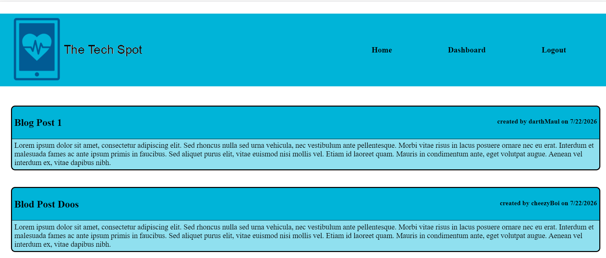

# Simple Tech Blog

  # Description 
  this is CMS-style blog site similar to a Wordpress site, where developers can publish their blog posts and comment on other developers’ posts as well. following the MVC paradigm in its architectural structure, using Handlebars.js as the templating language, Sequelize as the ORM, and the express-session npm package for authentication.

  

  # Table of Contents

  *[Delployed links](#Deployed-links)

  *[Installation Instructions](#installation)

  *[Contribution Guidelines](#Contribution)

  *[Test Instructions](#Test)

  *[Liscence](#Liscence)
   

  # Deployed-links 
  This app is deployed at https://sleepy-savannah-69456.herokuapp.com/  
  GitHub https://github.com/yurikitchin/Tech-Blog

  # Installation Instructions 
  clone the repo from https://github.com/yurikitchin/Tech-Blog then run npm i to install the dependencies and npm start to start the server, you can also view the app view the heroku link

  # Contribution Guidelines 
  There are no contributors on this project

  # Test Instructions 
  there is no testing on this project

  # Licence
  Simple Tech Blog is licenced under the MIT licence 
  Copyright © 2021,
   
  Licence documentation can be found at [https://opensource.org/licenses/MIT]
  # Author
  https://github.com/yurikitchin/
  ykitchin@gmail.com
